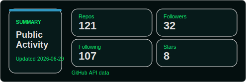
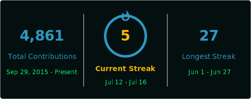

# 홍승표 / ph4nt0m

오펜시브 보안 연구자 · 웹/앱 모의해킹 · OT/ICS 보안

## 소개
- 서울을 기반으로 활동하는 오펜시브 보안 연구자입니다.
- 웹/앱, OT/ICS, 취약점 연구, 익스플로잇 개발, 퍼징, 리버스 엔지니어링을 다룹니다.
- 발견한 취약점을 재현 가능한 분석과 실전형 도구로 정리합니다.

## 주요 내용
- CoreSecurity ICS 보안 연구자
- CVE 21건 보유
- NATO CCDCOE Locked Shields 2025 DFIR CTF 1위
- NATO CCDCOE Locked Shields 2026 Special System 9위

취약점 목록

### OS Kernel
- CVE-2019-18885
- CVE-2019-19036
- CVE-2019-19037
- CVE-2019-19039
- CVE-2019-19318
- CVE-2019-19319
- CVE-2019-19377
- CVE-2019-19378
- CVE-2019-19447
- CVE-2019-19448
- CVE-2019-19449
- CVE-2019-19813
- CVE-2019-19814
- CVE-2019-19815
- CVE-2019-19816
- CVE-2019-19927

### IoT
- CVE-2024-33788
- CVE-2024-33789
- CVE-2024-33791
- CVE-2024-33792
- CVE-2024-33793

## 활동 통계
<table align="center" cellspacing="12" cellpadding="0">
  <tr>
    <td align="center" width="50%">
      
    </td>
    <td align="center" width="50%">
      
    </td>
  </tr>
</table>

## 연락처
- 포트폴리오: https://ph4nt0mm.notion.site
- X: https://twitter.com/Ph4nt0mm
- 이메일: newbiepwner@kakao.com
