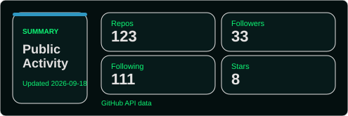
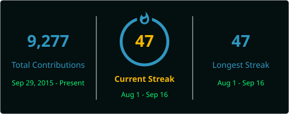

# Ph4nt0m

Offensive Security Researcher

## Interest in..
### AI
- RAG, Automation, Agentic Framework, etc..
### Security
- Web/App, IoT, Binary, Fuzzing

## About Me
[Link](https://phantomn.github.io/ko/about/)

## Statistics
<table align="center" cellspacing="12" cellpadding="0">
  <tr>
    <td align="center" width="50%">
      
    </td>
    <td align="center" width="50%">
      
    </td>
  </tr>
</table>
